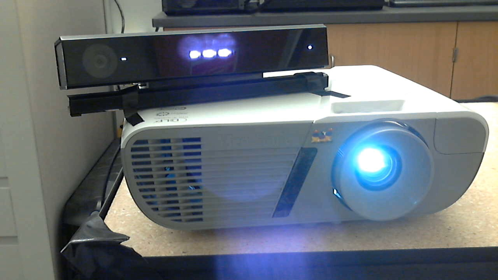
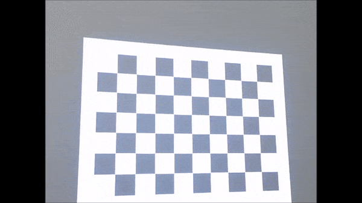
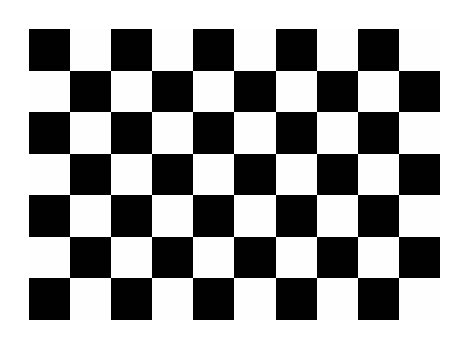
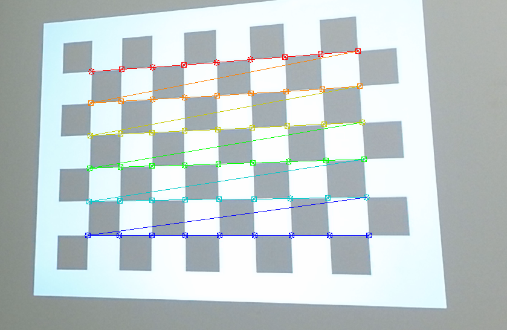
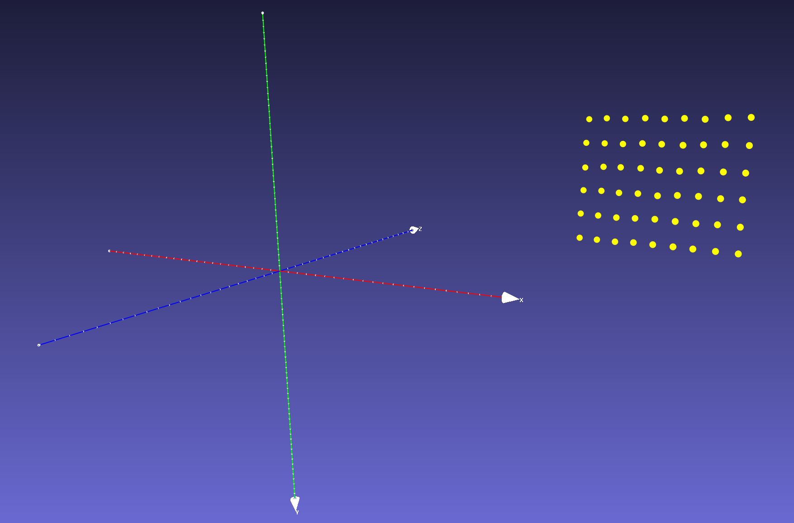
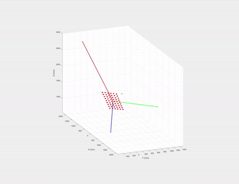
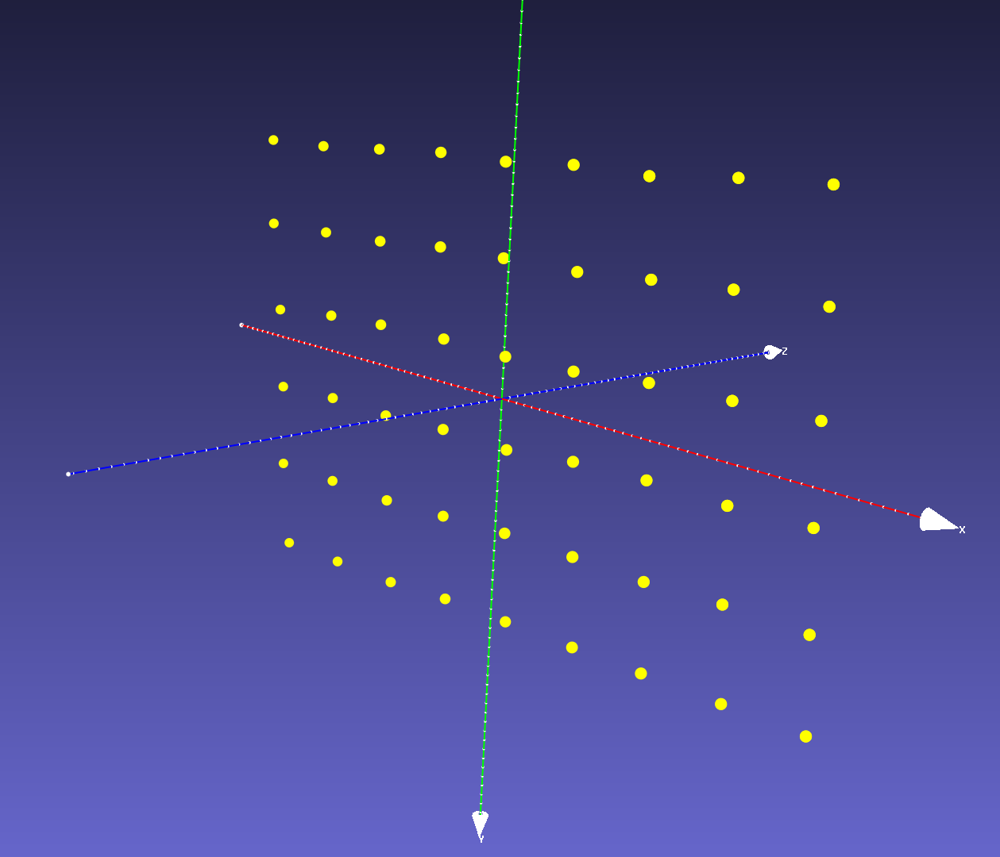

We want to combine Microsoft Kinect and a projector to create cool [Augmented Reality (AR) applications](http://genekogan.com/works/kinect-projector-toolkit/), one prerequisite is system calibration. Existing methods, such as [RGBDdemo][1] and [KinectProjectorToolkit][2] either requires printed checkerboard patterns or a large room to calibrate Kinect depth/color cameras and a projector. 

In most simple AR applications, we bind the Kinect and the projector (their FOV overlaps), thus the relative rotation and translation between the two are fixed. 




{.center_img}

In this case, neither a printed checkerboard pattern or a large room is needed. We can calibrate the system using  [Zhang's method][5] by projecting a checkerboard pattern to a white flat wall,  then move the whole Kinect-projector pair together to capture at least 3 shots from different position/orientations.


In this article, we focus on calibrating the **intrinsic parameters of the projector** and the **extrinsic parameters between the projector and the Kinect depth camera**. The intrinsics of the Kinect color/depth cameras can either be obtained from Kinect Windows SDK or calibrated using printed checkerboard, thus they are not discussed in this article.

## Projected checkerboard image
We first generate a checkerboard image pattern using OpenCV:

```c++
Mat generateCheckerboardImg(Size imgSize, Size boardSize, vector<Point2f>& cbPts2d) {	
	int offset = 50; // opencv requires white boarders around checkerboard pattern

	// checkerboard image
	Mat imgCheckerboard(imgSize, CV_8UC3, Scalar::all(255));

	// block size
	int squareWidth = floor((imgSize.width - 2 * offset) / boardSize.width);
	int squareHeight = floor((imgSize.height - 2 * offset) / boardSize.height);

	// block color
	unsigned char color = 1;

	//! The order must be consistent with OpenCV order: 
    //row first then column, each row sweep from left to right
	for (int y = offset; y < imgSize.height - offset; y = y + squareHeight) {
		color = ~color;
		if (y + squareHeight > imgSize.height - offset) {
			break;
		}

		for (int x = offset; x < imgSize.width - offset; x = x + squareWidth) {
			color = ~color;
			if (x + squareWidth > imgSize.width - offset) {
				break;
			}

			// save checkerboard points
			if (x > offset && y > offset) {
				cbPts2d.push_back(Point2f(x, y));
			}

			// color the block
			Mat block = imgCheckerboard(Rect(x, y, squareWidth, squareHeight));
			block.setTo(Scalar::all(color));

		}
	}

	return imgCheckerboard;
}
```
*The code is inspired by [Haris][3]*

where `boardSize` contains the number of squares in row and column, `cbPts2d` stores a list of inner corners of the checkerboard is given by:

$$ \mathbf{P}^{2d}_{p} = [ \mathbf{q}_0, \mathbf{q}_1,\dots \mathbf{q}_i, \dots \mathbf{q}_N ] $$

where $\mathbf{q}_i = [ u_i, v_i ]$ is the 2D coordinate of the $i^{th}$ checkerboard corner in projector image space, *N = `boardSize.width`\*`boardSize.height`*.

The generated checkerboard image is shown below, since OpenCV [findChessboardCorners][6] requires **white boarders** around the checkerboard pattern, we need to add offset to both x and y directions



Then we project this image to a white flat wall using the projector. In the meanwhile, we use the Kinect to capture a depth and a color frame of the projected checkerboard pattern at each projector positions/orientations. Note we need at least 3 different positions/orientations.

## Getting the 3D-2D coordinates of the checkerboard corners
Let $\mathbf{P}^{3d}$ be a set of 3D coordinates of the projected checkerboard corners:

$$ \mathbf{P}^{3d} = [ \mathbf{x}_0, \mathbf{x}_1,\dots \mathbf{x}_i, \dots \mathbf{x}_N ] $$

where $\mathbf{x}_i = [ X_i, Y_i, Z_i ]$ is the 3D coordinate of the $i^{th}$ checkerboard corner in Kinect **depth camera view space**.

We extract checkerboard corners $$\mathbf{P}^{2d}_{c}$$ from Kinect color image using `findChessboardCorners ` and their corresponding 3D coordinates $\mathbf{P}^{3d}$ from Kinect depth image. This step is very simple if you use Kinect Windows SDK v2.0. For more information please refer to [Kinect CoordinateMapper][4]. Note $$\mathbf{P}^{2d}_{c}$$ is only used to extract $\mathbf{P}^{3d}$ from depth image using Kinect CoordinateMapper, but if you want to calibrate Kinect color camera keep  $$\mathbf{P}^{2d}_{c}$$ for later use.



Make sure the order of $$\mathbf{P}^{2d}_{c}$$ in the image above matches the order of those in $\mathbf{P}^{3d}$, basically the corner colors represent the order of the poitns in $$\mathbf{P}^{2d}_{c}$$, red is the first element in $$\mathbf{P}^{2d}_{c}$$ vector and dark blue is the last one.

Now we have the 3D-2D point pairs ($\mathbf{P}^{3d}$ and $$\mathbf{P}^{2d}_{p}$$) to calibrate the projector intrinsics and extrinsics. But if you send the point pairs directly to OpenCV's [calibrateCamera][5] an exception will be raised, because this function requires the Z values of `objectPoints` to be zeros, since [Zhang's method][5] assumes all `objectPoints` reside on the XY plane of checkerboard object space, thus the 3x4 projection matrix $$\mathbf{K[RT]}$$  is reduced to a 3x3 homography $\mathbf{H}$.

If we plot $\mathbf{P}^{3d}$ we can see that they reside on the same plane but the Z values are nonzero, because their 3D coordinates are defined in Kinect **depth camera view space** rather than checkerboard object space. 



One may ask *can we generate the 3D coordinates of these checkerboard corners like what we do to the printed checkerboard?* The answer is no, unlike a real checkerboard, the projected image is distorted and skewed due to the perspective projection. The distortion varies each time we change the projector's position/orientation in respect to the wall. So each projected checkerboard image on the wall has different unknown scales and geometries.

## Rotate 3D points using eigenvectors
One workaround is to estimate a rotation and translation between Kinect depth camera view space and the checkerboard object space, then rotate and translate $\mathbf{P}^{3d}$ to the canonical view, so that they reside in the XY plane of Kinect depth camera view space. This requires the parameters of the checkerboard plane, luckily we know $\mathbf{P}^{3d}$ form a planar shape with arbitrary orientations and translations, we can estimate the plane using one the following three methods:

1. choose any **three non-collinear** points to calculate the plane's normal (Z) and X, Y axes directions in the checkerboard object space.
2. use **all** the points to fit a plane subject to minimizing the linear least squares error. Then choose any two points to calculate X(or Y) axis and the other axis is the cross product of normal and X(or Y): Y = `cross`(X, Z).
3. use the eigenvectors of $\mathbf{P}^{3d}$'s covariance matrix as the plane's XYZ axes.

But for method 1, which three points should we choose to estimate the plane? The same question applies to method 2 too, which two points should we use to estimate X (or Y) axis? We prefer method 3 since it considers all points in $\mathbf{P}^{3d}$ and it is simpler.

### Geometric interpretation of eigenvectors and Singular Value Decomposition (SVD)

If we draw the eigenvectors (with their magnitude being corresponding eigenvalues) of $\mathbf{P}^{3d}$'s covariance matrix, what are the directions of the three eigenvectors? 



The first two must be on the checkerboard plane and the third is the normal of the plane! Let us recall **eigen decomposition**, let the covariance matrix of $\mathbf{P}^{3d}$ be:

$$\mathbf{\Sigma} = (\mathbf{x}_i - \bar{\mathbf{x}})(\mathbf{x}_i - \bar{\mathbf{x}})^{T}$$

where $\mathbf{x}_i$ is the $i^{th}$ point, and $\bar{\mathbf{P}}^{3d}$ is the mean of $\mathbf{P}^{3d}$. 

The eigen decomposition of $\mathbf{\Sigma}$ is given by:
$\mathbf{\Sigma} = \mathbf{U}\mathbf{S}^{2}\mathbf{U}^T$, where the diagnal of $\mathbf{S}^{2}$ are eigenvalues and $\mathbf{U}$'s columns are the eigenvectors of $\mathbf{\Sigma}$ and **they are also the left singular vectors of $(\mathbf{x}_i - \bar{\mathbf{x}})$**. 

So we use SVD to obtain eigenvectors instead of computing an expensive covariance matrix:
1. Center $\bar{\mathbf{P}}^{3d}$ at depth camera view space's origin by:
$\bar{\mathbf{P}}^{3d} = \mathbf{C}\mathbf{P}^{3d}$, where $\mathbf{C} = \mathbf{I} - \frac{\mathbf{O}}{n}$ is a [centering matrix][8].
2. Apply SVD to centered 3D points:  $\mathbf{U}\mathbf{S}\mathbf{V}^T = \bar{\mathbf{P}}^{3d}$. 
3. To rotate $\bar{\mathbf{P}}^{3d}$ to Kinect depth camera view space's XY plane, we only need to left multiply the inverse of $\mathbf{U}$, i.e.,  $\mathbf{U}^{T}$ to $\bar{\mathbf{P}}^{3d} \rightarrow \mathbf{P}^{3d}_{obj} = \mathbf{U}^{T}\bar{\mathbf{P}}^{3d}$.
4. Due to projector and Kinect sensor noise and nonplanarity of the wall, the translated and rotated $\mathbf{P}^{3d}_{obj}$ may have very small Z values, we can orthogonally project the points to depth camera view space's XY plane by setting Z = 0.

Note in step 3, we do not constrain the sign of eigenvectors in this article because they do not affect projector **intrinsics** calibration.

Finally, we have 3D checkerboard corners $$\mathbf{P}^{3d}_{obj}$$  and 2D checkerboard corners in projector image space $$\mathbf{P}^{2d}_{p}$$ to calibrate the projector intrinsics using [calibrateCamera][5].



### Projector and Kinect depth camera extrinsics
We can also obtain the relative rotation and translation $RT$ by sending the calibrated projector intrinsics, known Kinect depth camera intrinsics, 3D checkerboard corners $$\mathbf{P}^{3d}_{obj}$$, 2D checkerboard corners in projector image space $$\mathbf{P}^{2d}_{p}$$ and 3D checkerboard corners in depth camera image space $$\mathbf{P}^{2d}_{d}$$ to OpenCV function [stereoCalibrate][7]. 

The calibrated projector intrinsic projection matrix $$K_p = $$

$$
\begin{array}{|l|l|l|}
\hline
1227.8 & 0      & 450.9 \\ \hline
0      & 1214.9 & 606.1 \\ \hline
0      & 0      & 1     \\ \hline
\end{array}
$$

projector distortion coefficients $$Kc_p = $$

$$
\begin{array}{|l|l|l|l|l|}
\hline
 -0.1708 & 1.0518 & -0.0168 & 0.0065 & -2.8967 \\ \hline
\end{array}
$$

extrinsics: $$RT = $$

$$
\begin{array}{|l|l|l|l|}
\hline
r1     & r2     & r3      & t (mm)   \\ \hline
0.9435 & -0.061 & -0.3256 & 177.72   \\ \hline
-0.004 & 0.9807 & -0.1953 & -92.0386 \\ \hline
0.3312 & 0.1856 & 0.9251  & -21.0593 \\ \hline
\end{array}
$$

[1]:http://rgbdemo.org/index.php/Documentation/TutorialProjectorKinectCalibration
[2]:https://github.com/genekogan/KinectProjectorToolkit
[3]:http://answers.opencv.org/question/27917/how-to-create-a-chess-board/?answer=27943#post-id-27943
[4]:https://msdn.microsoft.com/en-us/library/windowspreview.kinect.coordinatemapper.aspx
[5]:https://docs.opencv.org/2.4/modules/calib3d/doc/camera_calibration_and_3d_reconstruction.html#calibratecamera
[6]:https://docs.opencv.org/2.4/modules/calib3d/doc/camera_calibration_and_3d_reconstruction.html#findchessboardcorners
[7]:https://docs.opencv.org/3.0-beta/modules/calib3d/doc/camera_calibration_and_3d_reconstruction.html#stereocalibrate
[8]:https://en.wikipedia.org/wiki/Centering_matrix
